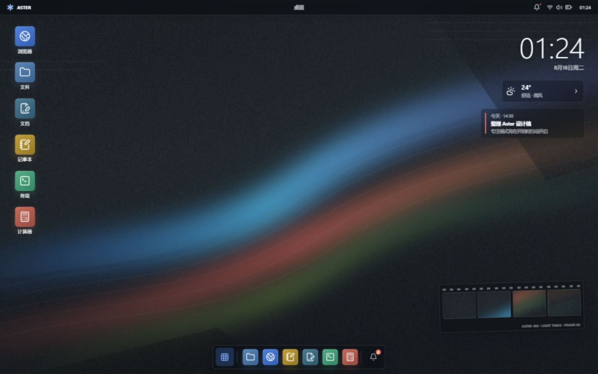
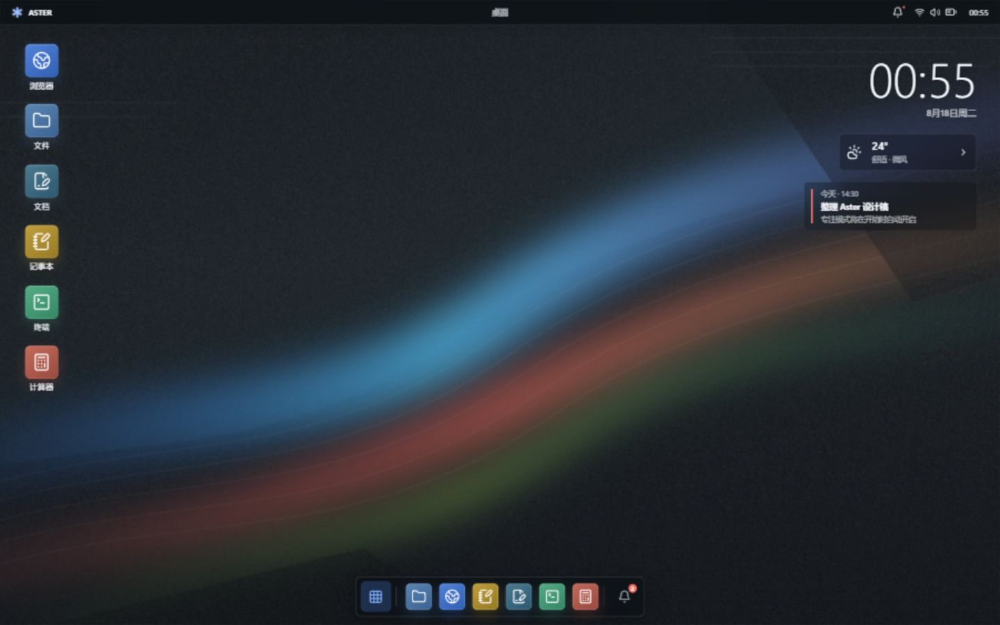
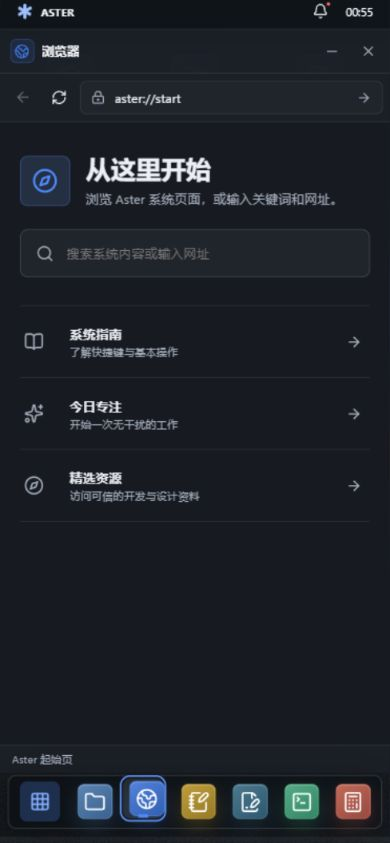

# Aster OS

> 一个以浏览器为运行环境的高仿桌面操作系统。它不是静态界面稿，而是一套可启动、可多任务处理、可本地保存内容的交互式系统。



## 概览

Aster OS 使用 React、TypeScript 与 Vite 构建，将完整的桌面体验带进浏览器：从开机、锁屏、应用启动，到多窗口协作、内容编辑和本地持久化，所有核心流程均可直接操作。

视觉系统以“摄影灯箱”为灵感：石墨色系统外壳、冰白内容表面、钴蓝/珊瑚/青柠信号色，以及带有胶片帧语言的桌面壁纸与窗口边界。

| 桌面 | 移动端 |
| --- | --- |
|  |  |

## 功能

### 系统体验

- 开机动画、锁屏与解锁焦点管理
- 桌面快捷方式、应用启动器、Dock、通知中心、控制中心与右键菜单
- 可拖拽、缩放、聚焦、最小化、最大化、还原与关闭的窗口管理
- 窄屏和横屏下的全工作区窗口模式，避免桌面窗口挤压内容
- 深浅主题、强调色、声音和 Dock 密度等本地设置
- 键盘可达的交互、清晰的焦点状态、减少动态效果支持和触摸目标优化

### 内置应用

| 应用 | 能力 |
| --- | --- |
| 浏览器 | 内置起始页、地址栏、前进后退、搜索、可点击的系统链接与安全外链 |
| 记事本 | 多笔记、搜索、自动保存和本地持久化 |
| 终端 | 安全的模拟命令、应用启动和主题切换；不会执行主机命令 |
| 计算器 | 安全表达式解析、括号、历史记录和键盘输入 |
| 文档 | 富文本编辑、多个文档、自动保存和字数统计 |
| 文件 | 文件夹浏览、网格/列表视图与内容预览 |
| 日历 | 动态月历与日程列表 |
| 设置 | 主题、强调色、声音与程序坞密度设置 |

## 快速开始

### 环境要求

- Node.js 20 或更高版本
- pnpm 10 或更高版本

### 安装与开发

```bash
pnpm install
pnpm dev
```

启动后打开终端显示的本地地址。开发服务器默认监听所有本地网络接口，便于在同一网络中的移动设备上测试。

### 构建与测试

```bash
pnpm build
pnpm test
```

`pnpm build` 会执行 TypeScript 校验与生产构建；`pnpm test` 会运行计算器表达式引擎的单元测试。

## 常用快捷键

| 快捷键 | 操作 |
| --- | --- |
| `Ctrl + Space` | 打开或关闭应用启动器 |
| `Alt + Tab` | 切换活动窗口 |
| `Alt + F4` | 关闭活动窗口 |
| 双击窗口标题栏 | 最大化或还原窗口 |
| `Escape` | 关闭暂态系统面板 |

## 数据与安全

- 笔记、文档和偏好保存在当前浏览器的本地存储中，不依赖后端服务。
- 终端是界面模拟器，不会调用主机 Shell 或执行系统命令。
- 外部网页通过新标签页打开；浏览器内部链接留在 Aster OS 的应用环境中。
- 项目不包含账号、云同步、遥测或跨设备数据能力。

## 项目结构

```text
src/
  App.tsx                 # 系统外壳、窗口状态和全局交互
  shell/                  # 开机界面、窗口框架与窗口行为
  apps/                   # 浏览器、记事本、终端、计算器等应用
  styles.css              # 桌面、Dock、面板与响应式规则
public/
  aster-wallpaper.svg     # 桌面壁纸
screenshots/              # 桌面与移动端验证截图
```

## 设计与实现说明

- [PRODUCT.md](PRODUCT.md)：产品边界、用户场景和长期约束。
- [DESIGN.md](DESIGN.md)：颜色、字体、间距、窗口层级、响应式和组件规范。
- [.impeccable/design.json](.impeccable/design.json)：供设计工具读取的机器可读设计侧车文件。

## 技术栈

- React 19
- TypeScript
- Vite
- react-rnd（窗口拖拽与缩放）
- Lucide React（图标）
- Vitest（测试）

## 可复现的验证范围

项目已完成生产构建与计算器单元测试，并覆盖了多窗口交互、浏览器内部导航、终端启动应用、笔记和文档保存、锁屏交互、短横屏计算器和桌面/移动端视觉状态的验证。

